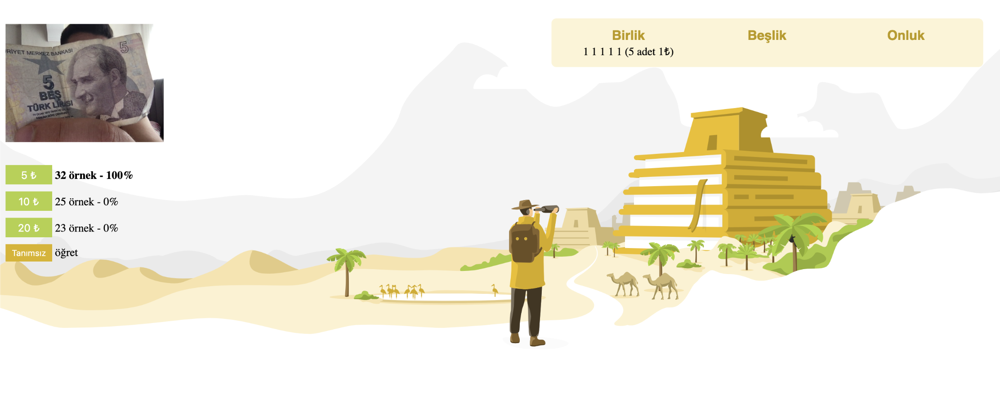

## Money Exchanger Nedir?
Genel amacı para bozdurma olan "money changer" uygulaması, webcam üzerinden gösterilen Türk lirasının ne kadar olduğunu hesaplayıp, kasadaki paralara göre en uygun bozdurma işlemini sağlar.

## Nasıl Çalıştırılır?

yarn (veya npm install)

npm start

wia/ https://www.tensorflow.org/js
